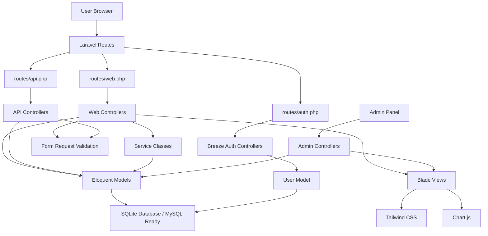
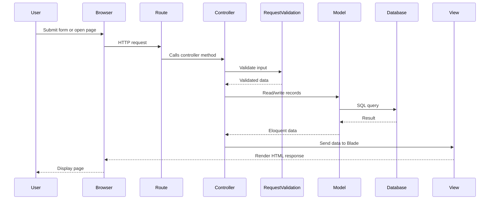
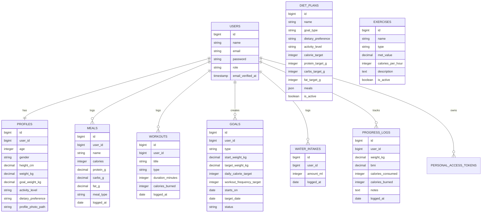
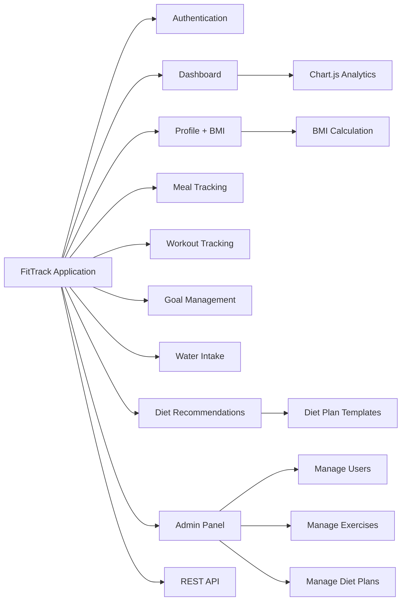
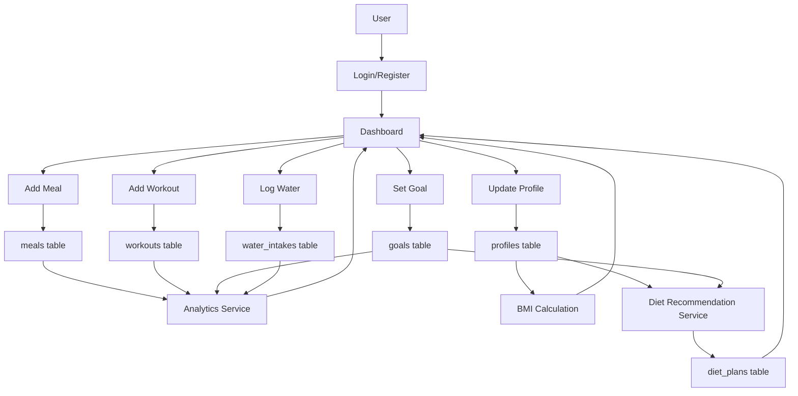
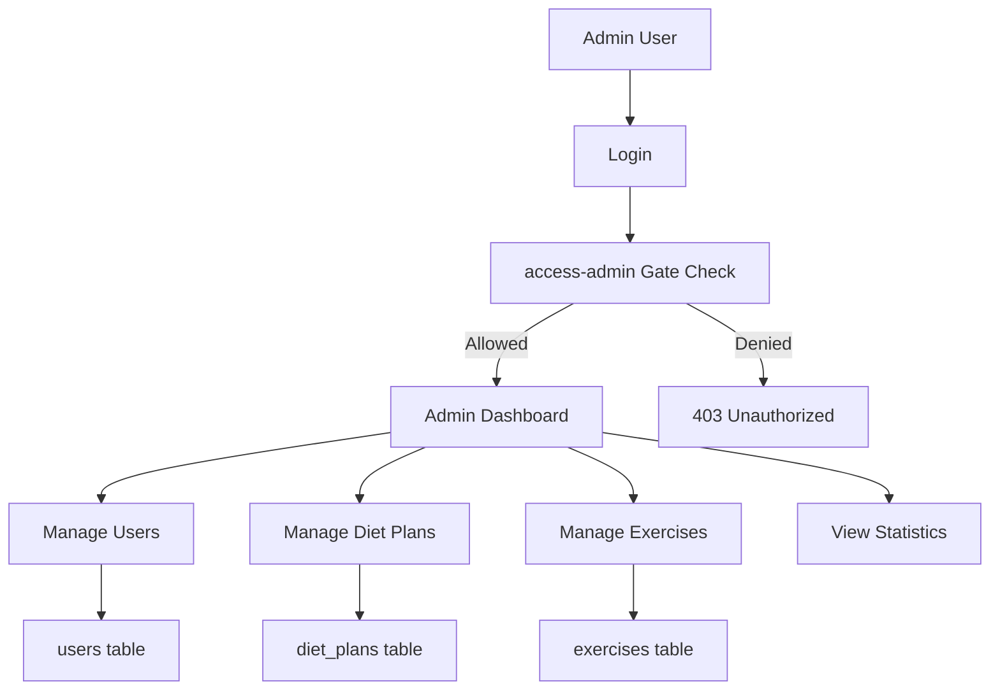
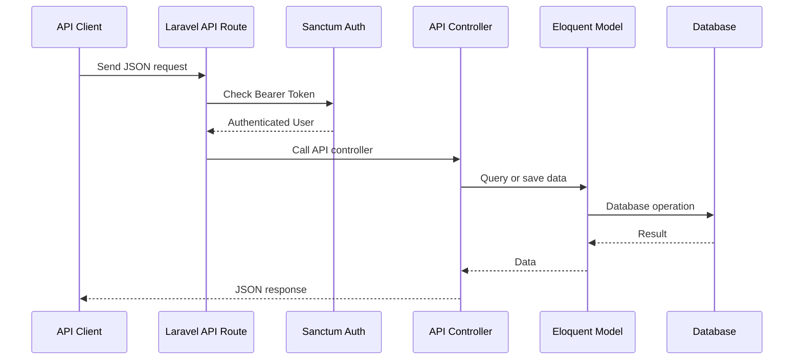

# FitTrack Health and Diet Tracker: Complete Project Overview

This document explains the complete project structure, diagrams, database, migrations, tables, features, and important files of the FitTrack Health and Diet Tracker project.

## 1. Project Summary

**Project Name:** FitTrack Health and Diet Tracker  
**Framework:** Laravel 12  
**Language:** PHP 8.2  
**Frontend:** Blade Templates, Tailwind CSS, Vite  
**Authentication:** Laravel Breeze  
**API Authentication:** Laravel Sanctum  
**Database Used Locally:** SQLite  
**Database Supported for Deployment:** MySQL  
**Analytics Library:** Chart.js  

FitTrack is a full-stack fitness tracking application where users can track meals, calories, workouts, BMI, weight goals, water intake, and diet recommendations. Admin users can manage users, diet plans, exercises, and platform statistics.

## 2. Whole Project Architecture Diagram



## 3. MVC Flow Diagram



## 4. Database Used

The project currently uses **SQLite** for local development.

From `.env`:

```env
DB_CONNECTION=sqlite
```

SQLite database file:

```text
database/database.sqlite
```

The project is also ready for MySQL. To use MySQL, update `.env` like this:

```env
DB_CONNECTION=mysql
DB_HOST=127.0.0.1
DB_PORT=3306
DB_DATABASE=health_diet_tracker
DB_USERNAME=root
DB_PASSWORD=
```

## 5. Total Migration Files

Total migration files used in this project:

```text
14 migration files
```

All migrations are currently run.

## 6. Migration File List

```text
0001_01_01_000000_create_users_table.php
0001_01_01_000001_create_cache_table.php
0001_01_01_000002_create_jobs_table.php
2026_05_13_145409_create_personal_access_tokens_table.php
2026_05_13_150000_add_role_to_users_table.php
2026_05_13_150100_create_profiles_table.php
2026_05_13_150200_create_meals_table.php
2026_05_13_150300_create_workouts_table.php
2026_05_13_150400_create_goals_table.php
2026_05_13_150500_create_water_intakes_table.php
2026_05_13_150600_create_diet_plans_table.php
2026_05_13_150700_create_progress_logs_table.php
2026_05_13_150800_create_exercises_table.php
2026_05_13_150900_create_notifications_table.php
```

## 7. Total Tables Used

Total actual database tables:

```text
19 tables
```

Laravel creates multiple tables from some default migrations. For example, the users migration creates `users`, `password_reset_tokens`, and `sessions`.

## 8. Table List and Purpose

| No. | Table Name | Purpose |
|---:|---|---|
| 1 | `migrations` | Tracks which migrations have already run |
| 2 | `users` | Stores user account details, email, password, and role |
| 3 | `password_reset_tokens` | Stores password reset tokens |
| 4 | `sessions` | Stores logged-in user sessions |
| 5 | `cache` | Stores Laravel cache data |
| 6 | `cache_locks` | Handles cache locking |
| 7 | `jobs` | Stores queued jobs |
| 8 | `job_batches` | Stores job batch information |
| 9 | `failed_jobs` | Stores failed queue jobs |
| 10 | `personal_access_tokens` | Stores Sanctum API tokens |
| 11 | `profiles` | Stores user health profile details |
| 12 | `meals` | Stores meal and calorie records |
| 13 | `workouts` | Stores workout records |
| 14 | `goals` | Stores fitness goals |
| 15 | `water_intakes` | Stores daily water intake logs |
| 16 | `diet_plans` | Stores diet recommendation templates |
| 17 | `progress_logs` | Stores weight, BMI, and progress history |
| 18 | `exercises` | Stores admin-managed exercise library |
| 19 | `notifications` | Stores Laravel notification records |

## 9. Entity Relationship Diagram



## 10. Main Module Diagram



## 11. Feature to File Mapping

### Authentication

```text
routes/auth.php
app/Http/Controllers/Auth/
resources/views/auth/
app/Models/User.php
```

### Dashboard

```text
routes/web.php
app/Http/Controllers/DashboardController.php
app/Services/AnalyticsService.php
resources/views/dashboard.blade.php
```

### Profile and BMI

```text
app/Http/Controllers/ProfileController.php
app/Http/Requests/ProfileUpdateRequest.php
app/Models/Profile.php
app/Services/HealthMetricService.php
resources/views/profile/edit.blade.php
resources/views/profile/partials/update-profile-information-form.blade.php
```

### Meal Tracking

```text
app/Models/Meal.php
app/Http/Controllers/MealController.php
app/Http/Requests/MealRequest.php
resources/views/meals/
database/migrations/2026_05_13_150200_create_meals_table.php
```

### Workout Tracking

```text
app/Models/Workout.php
app/Http/Controllers/WorkoutController.php
app/Http/Requests/WorkoutRequest.php
resources/views/workouts/
database/migrations/2026_05_13_150300_create_workouts_table.php
```

### Goal Management

```text
app/Models/Goal.php
app/Http/Controllers/GoalController.php
app/Http/Requests/GoalRequest.php
resources/views/goals/
database/migrations/2026_05_13_150400_create_goals_table.php
```

### Water Intake

```text
app/Models/WaterIntake.php
app/Http/Controllers/WaterIntakeController.php
app/Http/Requests/WaterIntakeRequest.php
resources/views/water-intakes/
database/migrations/2026_05_13_150500_create_water_intakes_table.php
```

### Diet Recommendations

```text
app/Models/DietPlan.php
app/Services/DietRecommendationService.php
app/Http/Controllers/DietRecommendationController.php
resources/views/recommendations/index.blade.php
database/migrations/2026_05_13_150600_create_diet_plans_table.php
```

### Admin Panel

```text
routes/web.php
app/Providers/AppServiceProvider.php
app/Http/Controllers/Admin/DashboardController.php
app/Http/Controllers/Admin/UserController.php
app/Http/Controllers/Admin/DietPlanController.php
app/Http/Controllers/Admin/ExerciseController.php
resources/views/admin/
```

### REST API

```text
routes/api.php
app/Http/Controllers/Api/AuthController.php
app/Http/Controllers/Api/MealController.php
app/Http/Controllers/Api/WorkoutController.php
app/Http/Controllers/Api/GoalController.php
app/Http/Controllers/Api/AnalyticsController.php
```

## 12. Important Models

```text
app/Models/User.php
app/Models/Profile.php
app/Models/Meal.php
app/Models/Workout.php
app/Models/Goal.php
app/Models/WaterIntake.php
app/Models/DietPlan.php
app/Models/ProgressLog.php
app/Models/Exercise.php
```

## 13. Important Controllers

```text
app/Http/Controllers/DashboardController.php
app/Http/Controllers/ProfileController.php
app/Http/Controllers/MealController.php
app/Http/Controllers/WorkoutController.php
app/Http/Controllers/GoalController.php
app/Http/Controllers/WaterIntakeController.php
app/Http/Controllers/DietRecommendationController.php
app/Http/Controllers/Admin/DashboardController.php
app/Http/Controllers/Admin/UserController.php
app/Http/Controllers/Admin/DietPlanController.php
app/Http/Controllers/Admin/ExerciseController.php
```

## 14. Important Service Classes

```text
app/Services/HealthMetricService.php
app/Services/AnalyticsService.php
app/Services/DietRecommendationService.php
```

### Service Responsibilities

| Service | Responsibility |
|---|---|
| `HealthMetricService` | Calculates BMI and BMI category |
| `AnalyticsService` | Builds dashboard chart data |
| `DietRecommendationService` | Suggests diet plans based on profile and goal |

## 15. Route Structure

### Web Routes

File:

```text
routes/web.php
```

Used for:

- Landing page
- Dashboard
- Meals
- Workouts
- Goals
- Water intake
- Recommendations
- Admin panel
- Profile

### Auth Routes

File:

```text
routes/auth.php
```

Used for:

- Login
- Register
- Logout
- Forgot password
- Reset password
- Email verification

### API Routes

File:

```text
routes/api.php
```

Used for:

- API register
- API login
- API logout
- Meals API
- Workouts API
- Goals API
- Analytics API

## 16. User Roles

### Normal User

Can:

- Register and login
- Update profile
- Add meals
- Add workouts
- Add goals
- Track water intake
- View dashboard
- View diet recommendations

### Admin User

Can:

- Access admin dashboard
- Manage users
- Manage diet plans
- Manage exercise library
- View platform statistics

Admin authorization is defined in:

```text
app/Providers/AppServiceProvider.php
```

Code concept:

```php
Gate::define('access-admin', fn (User $user): bool => $user->isAdmin());
```

## 17. Data Flow Diagram



## 18. Admin Flow Diagram



## 19. API Flow Diagram



## 20. API Endpoints

### Public API

```text
POST /api/register
POST /api/login
```

### Protected API

```text
POST /api/logout
GET /api/user
GET /api/analytics
```

### Meal API

```text
GET /api/meals
POST /api/meals
GET /api/meals/{meal}
PUT /api/meals/{meal}
DELETE /api/meals/{meal}
```

### Workout API

```text
GET /api/workouts
POST /api/workouts
GET /api/workouts/{workout}
PUT /api/workouts/{workout}
DELETE /api/workouts/{workout}
```

### Goal API

```text
GET /api/goals
POST /api/goals
GET /api/goals/{goal}
PUT /api/goals/{goal}
DELETE /api/goals/{goal}
```

## 21. Frontend Structure

```text
resources/views/welcome.blade.php
resources/views/dashboard.blade.php
resources/views/layouts/app.blade.php
resources/views/layouts/navigation.blade.php
resources/views/auth/
resources/views/profile/
resources/views/meals/
resources/views/workouts/
resources/views/goals/
resources/views/water-intakes/
resources/views/recommendations/
resources/views/admin/
resources/views/components/
```

## 22. CSS and Build Files

```text
resources/css/app.css
resources/js/app.js
tailwind.config.js
postcss.config.js
vite.config.js
package.json
```

## 23. Testing Files

```text
tests/Feature/Auth/
tests/Feature/ProfileTest.php
tests/Feature/MealTrackingTest.php
tests/Feature/ExampleTest.php
tests/Unit/ExampleTest.php
phpunit.xml
```

Run tests:

```powershell
php artisan test
```

## 24. Seed Data

Seed data is created in:

```text
database/seeders/DatabaseSeeder.php
```

Seeder creates:

- Admin account
- User account
- User profile
- Diet plans
- Exercise library
- Fitness goal
- Meal records
- Workout records
- Water records
- Progress logs

Demo accounts:

```text
User:  user@fittrack.test / password
Admin: admin@fittrack.test / password
```

## 25. Commands to Run Project

Open project folder:

```powershell
cd "C:\Users\Akshat Rana\Documents\New project\health-diet-tracker"
```

Start Laravel:

```powershell
php artisan serve --host=127.0.0.1 --port=8000
```

Start Vite in another terminal:

```powershell
npm.cmd run dev
```

Open:

```text
http://127.0.0.1:8000
```

## 26. Summary for Viva

Use this short explanation:

FitTrack is a Laravel 12 full-stack health and diet tracker. It uses Breeze for authentication, Blade and Tailwind for UI, SQLite locally, Eloquent ORM for database operations, and Chart.js for analytics. Users can track meals, workouts, goals, BMI, water intake, and diet recommendations. Admins can manage users, diet plans, and exercise data. The project has 14 migration files and 19 database tables. It follows MVC architecture and includes REST APIs using Laravel Sanctum.

