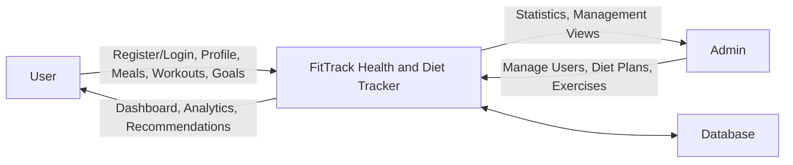
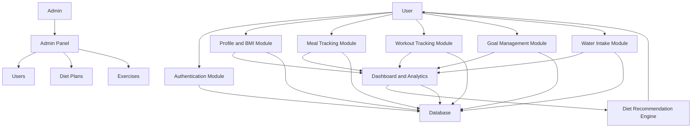
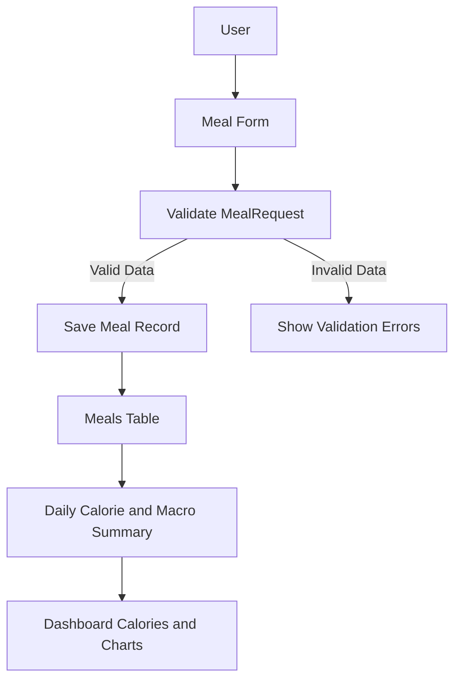

# FitTrack Health and Diet Tracker

# Software Requirements Specification

**Course Code:** `<Enter Course Code>`  
**Course Name:** `<Enter Course Name>`  

**Student Names:**  
`<Enter Student Name 1>`  
`<Enter Student Name 2, if applicable>`  

**Student Registration Numbers:**  
`<Enter Registration Number 1>`  
`<Enter Registration Number 2, if applicable>`  

**Prepared for:** Continuous Assessment 3  
**Semester:** Spring 2025  

---

## Table of Contents

Revision History  
1. Introduction  
1.1 Purpose  
1.2 Scope  
1.3 Definitions, Acronyms, and Abbreviations  
1.4 References  
1.5 Overview  
2. General Description  
2.1 Product Perspective  
2.2 Product Functions  
2.3 User Characteristics  
2.4 General Constraints  
2.5 Assumptions and Dependencies  
3. Specific Requirements  
3.1 External Interface Requirements  
3.1.1 User Interfaces  
3.1.2 Hardware Interfaces  
3.1.3 Software Interfaces  
3.1.4 Communications Interfaces  
3.2 Functional Requirements  
3.2.1 Authentication Module  
3.2.2 Dashboard Module  
3.2.3 Profile and BMI Module  
3.2.4 Meal Tracking Module  
3.2.5 Workout Tracking Module  
3.2.6 Goal Management Module  
3.2.7 Water Intake Module  
3.2.8 Diet Recommendation Module  
3.2.9 Admin Panel Module  
3.2.10 REST API Module  
3.5 Non-Functional Requirements  
3.5.1 Performance  
3.5.2 Reliability  
3.5.3 Availability  
3.5.4 Security  
3.5.5 Maintainability  
3.5.6 Portability  
3.7 Design Constraints  
3.9 Other Requirements  
4. Analysis Models  
4.1 Data Flow Diagrams  
5. GitHub Link  
6. Deployed Link  
7. Client Approval Proof  
8. Client Location Proof  
9. Transaction ID Proof  
10. Email Acknowledgement  
11. GST No  
A. Appendices  
A.1 Appendix 1  
A.2 Appendix 2  

---

## Revision History

| Version | Date | Description | Author |
|---|---|---|---|
| 1.0 | 16 May 2026 | Initial SRS report for FitTrack Health and Diet Tracker | `<Student Name>` |

---

# 1. Introduction

FitTrack Health and Diet Tracker is a full-stack web application designed to help users track meals, calories, workouts, BMI, water intake, weight goals, and overall fitness progress. The system also includes an admin panel for managing users, diet plans, and exercise records.

This Software Requirements Specification document describes the functional and non-functional requirements of the FitTrack application. It is intended to guide the design, implementation, testing, and presentation of the project.

## 1.1 Purpose

The purpose of this SRS document is to define the requirements for the FitTrack Health and Diet Tracker application. The document is written for:

- Students developing and presenting the project.
- Faculty members evaluating the project.
- Software engineers who may design, implement, test, or maintain the system.
- Future developers who may extend the application.

This document explains what the application does, how users interact with it, what modules are included, and what technical constraints apply.

## 1.2 Scope

The software product is named **FitTrack Health and Diet Tracker**.

FitTrack provides a centralized platform where users can:

- Register and log in securely.
- Update personal health profile details.
- Track daily meals and calorie intake.
- Track macronutrients such as protein, carbohydrates, and fat.
- Track workouts, workout duration, and calories burned.
- Monitor BMI and BMI category.
- Set weight loss, weight gain, or maintenance goals.
- Track water intake.
- View progress analytics through dashboard charts.
- Receive basic personalized diet recommendations.

Admin users can:

- Manage registered users.
- Manage diet plan templates.
- Manage exercise library records.
- View platform statistics.

The system does not currently provide:

- Real-time wearable device integration.
- AI-based image recognition for food.
- Online payment processing.
- Doctor or dietician consultation.
- Production deployment by default.

The main objective of the system is to support users in maintaining healthier routines by organizing diet, workout, and health progress data in one web dashboard.

## 1.3 Definitions, Acronyms, and Abbreviations

| Term | Meaning |
|---|---|
| SRS | Software Requirements Specification |
| BMI | Body Mass Index |
| CRUD | Create, Read, Update, Delete |
| API | Application Programming Interface |
| REST | Representational State Transfer |
| ORM | Object Relational Mapping |
| UI | User Interface |
| UX | User Experience |
| DBMS | Database Management System |
| MVC | Model View Controller |
| CSRF | Cross-Site Request Forgery |
| XSS | Cross-Site Scripting |
| PWA | Progressive Web Application |
| Admin | User role with management permissions |
| User | Normal registered user of the application |

## 1.4 References

| Reference | Description |
|---|---|
| Laravel Documentation | Official Laravel framework documentation: https://laravel.com/docs |
| Laravel Breeze Documentation | Authentication scaffolding documentation |
| Laravel Sanctum Documentation | API token authentication documentation |
| Tailwind CSS Documentation | Utility-first CSS framework documentation |
| Chart.js Documentation | JavaScript charting library documentation |
| IEEE SRS Guidelines | General SRS document structure and requirement-writing guidance |

## 1.5 Overview

The rest of this SRS document is organized as follows:

- Section 2 describes the general product perspective, functions, user characteristics, constraints, assumptions, and dependencies.
- Section 3 describes detailed functional and non-functional requirements.
- Section 4 contains analysis models and data flow diagrams.
- Sections 5 to 11 contain project submission proof placeholders such as GitHub link, deployment link, client approval proof, and other academic documentation fields.
- Appendix sections provide additional supporting information such as installation steps, demo credentials, and project file structure.

---

# 2. General Description

## 2.1 Product Perspective

FitTrack is a standalone web-based health and diet tracking system. It is developed using the Laravel 12 framework and follows the MVC architecture.

The application can run locally using:

- Laravel development server.
- Vite development server.
- SQLite or MySQL database.

The system is designed as a full-stack project, combining:

- Backend logic using Laravel controllers, models, services, requests, middleware, and policies.
- Frontend interface using Blade templates and Tailwind CSS.
- Analytics using Chart.js.
- REST APIs using Laravel Sanctum.

FitTrack can be used as an academic project, prototype, or foundation for a production-ready fitness management system.

## 2.2 Product Functions

The major product functions are:

- User authentication and account management.
- User profile and health metric management.
- BMI calculation and category display.
- Meal logging and calorie tracking.
- Macronutrient tracking.
- Workout logging and burned calorie tracking.
- Fitness goal creation and progress tracking.
- Water intake logging.
- Diet recommendation generation.
- Dashboard analytics and charts.
- Admin user management.
- Admin diet plan management.
- Admin exercise library management.
- REST API support for meals, workouts, goals, and analytics.

## 2.3 User Characteristics

The system supports two main user categories.

### Normal User

Normal users are individuals who want to track their health and fitness progress. They may have basic computer knowledge and should be able to use forms, dashboards, and charts easily.

Expected user activities:

- Register and log in.
- Add meals.
- Add workouts.
- Update profile details.
- Track BMI and goals.
- View progress charts.

### Admin User

Admin users manage platform data. They should understand basic application administration and data management.

Expected admin activities:

- Manage users.
- Add or edit diet plans.
- Add or edit exercises.
- View platform statistics.

## 2.4 General Constraints

The system has the following constraints:

- The application requires PHP 8.2 or higher.
- The application requires Composer for PHP dependency management.
- The application requires Node.js and npm for frontend asset compilation.
- The system is designed using Laravel 12.
- The user interface is built using Blade and Tailwind CSS.
- The local environment uses SQLite by default, but the system is MySQL-ready.
- Browser access is required.
- Internet access may be required during initial dependency installation.
- Email verification uses Laravel mail configuration and logs email locally by default.

## 2.5 Assumptions and Dependencies

The following assumptions apply:

- Users have access to a modern browser.
- The local machine has PHP, Composer, Node.js, and npm installed.
- The database is available and migrations have been executed.
- Users provide accurate height and weight values for BMI calculation.
- Calorie and workout data entered by users is assumed to be correct.
- Admin users are trusted users.

Dependencies:

- Laravel Framework
- Laravel Breeze
- Laravel Sanctum
- Tailwind CSS
- Chart.js
- Vite
- SQLite or MySQL

---

# 3. Specific Requirements

This section defines the specific requirements that guide the design, implementation, and testing of the FitTrack system.

## 3.1 External Interface Requirements

### 3.1.1 User Interfaces

The application shall provide a responsive web interface.

User interface requirements:

- The system shall provide a landing page.
- The system shall provide login and registration pages.
- The system shall provide a dashboard page after login.
- The system shall provide forms for meals, workouts, goals, profile, and water intake.
- The system shall provide charts for analytics.
- The system shall provide an admin dashboard for admin users.
- The user interface shall be responsive on desktop and mobile screens.
- The visual theme shall use emerald, cyan, dark slate, and white colors.

### 3.1.2 Hardware Interfaces

The system does not require special hardware.

Minimum hardware for local execution:

- Computer or laptop.
- 4 GB RAM recommended.
- 1 GB free storage.
- Keyboard, mouse, and display.

### 3.1.3 Software Interfaces

The application interfaces with:

- PHP 8.2 runtime.
- Laravel 12 framework.
- SQLite or MySQL database.
- Web browser.
- Node.js and npm.
- Chart.js for analytics rendering.
- Laravel Sanctum for API token authentication.

### 3.1.4 Communications Interfaces

The application communicates using HTTP.

Communication interfaces:

- Browser to Laravel web server using HTTP.
- Laravel backend to database using configured database connection.
- API clients to Laravel API endpoints using JSON over HTTP.
- Authenticated API requests use Bearer token authorization.

## 3.2 Functional Requirements

### 3.2.1 Authentication Module

#### 3.2.1.1 Introduction

The authentication module allows users to register, log in, log out, verify email, reset password, and manage account security.

#### 3.2.1.2 Inputs

- Name
- Email
- Password
- Password confirmation
- Login credentials
- Reset password email

#### 3.2.1.3 Processing

- The system validates registration data.
- The system stores passwords using secure hashing.
- The system authenticates users using Laravel Breeze.
- The system redirects authenticated users to the dashboard.
- The system restricts dashboard access to authenticated and verified users.

#### 3.2.1.4 Outputs

- Successful registration message.
- Login session.
- Dashboard access.
- Validation error messages.
- Password reset email or log entry.

#### 3.2.1.5 Error Handling

- Invalid login credentials shall show an error.
- Duplicate emails shall be rejected.
- Weak passwords shall be rejected.
- Unverified users shall be directed to email verification.

### 3.2.2 Dashboard Module

#### 3.2.2.1 Introduction

The dashboard summarizes user health and fitness data.

#### 3.2.2.2 Inputs

- Meal records.
- Workout records.
- Water intake records.
- Profile records.
- Goal records.
- Progress logs.

#### 3.2.2.3 Processing

- The system calculates daily calories consumed.
- The system calculates daily calories burned.
- The system calculates hydration progress.
- The system calculates BMI.
- The system calculates workout streak.
- The system prepares weekly chart data.

#### 3.2.2.4 Outputs

- Current weight card.
- Calories consumed card.
- Calories burned card.
- BMI card.
- Water progress bar.
- Goal progress bar.
- Weekly charts.
- Diet recommendations.

#### 3.2.2.5 Error Handling

- If profile data is missing, the system shall show placeholder values.
- If chart data is empty, charts shall display zero or empty data safely.

### 3.2.3 Profile and BMI Module

#### 3.2.3.1 Introduction

The profile module stores health-related user information and calculates BMI.

#### 3.2.3.2 Inputs

- Age
- Gender
- Height
- Weight
- Goal weight
- Activity level
- Dietary preference
- Profile photo

#### 3.2.3.3 Processing

- The system validates profile fields.
- The system stores profile data.
- The system calculates BMI using weight and height.
- The system determines BMI category.
- The system creates or updates progress logs.

#### 3.2.3.4 Outputs

- Updated profile.
- BMI value.
- BMI category.
- Progress log entry.

#### 3.2.3.5 Error Handling

- Invalid height or weight shall be rejected.
- Invalid image uploads shall be rejected.
- Missing optional fields shall not crash the system.

### 3.2.4 Meal Tracking Module

#### 3.2.4.1 Introduction

The meal tracking module allows users to log daily meals and nutrition values.

#### 3.2.4.2 Inputs

- Meal name
- Calories
- Protein
- Carbs
- Fat
- Meal type
- Date

#### 3.2.4.3 Processing

- The system validates meal data.
- The system stores meal records for the authenticated user.
- The system filters meals by date.
- The system calculates daily calorie and macro totals.

#### 3.2.4.4 Outputs

- Meal list.
- Meal history.
- Daily calorie total.
- Protein, carbs, and fat totals.
- Updated dashboard calorie count.

#### 3.2.4.5 Error Handling

- Calories must be numeric and non-negative.
- Macro values must be numeric and non-negative.
- Meal type must be one of the allowed values.
- Unauthorized users cannot access another user's meal records.

### 3.2.5 Workout Tracking Module

#### 3.2.5.1 Introduction

The workout module tracks user exercises, duration, and burned calories.

#### 3.2.5.2 Inputs

- Workout title
- Workout type
- Duration
- Calories burned
- Date

#### 3.2.5.3 Processing

- The system validates workout data.
- The system stores workout records for the authenticated user.
- The system calculates calories burned for the selected date.
- The system contributes workout data to analytics charts.

#### 3.2.5.4 Outputs

- Workout list.
- Total duration.
- Total burned calories.
- Updated dashboard burned calorie count.

#### 3.2.5.5 Error Handling

- Duration must be at least one minute.
- Calories burned must be non-negative.
- Workout type must be valid.

### 3.2.6 Goal Management Module

#### 3.2.6.1 Introduction

The goal management module allows users to define and monitor fitness goals.

#### 3.2.6.2 Inputs

- Goal type
- Start weight
- Target weight
- Daily calorie target
- Workout frequency target
- Start date
- Target date
- Status

#### 3.2.6.3 Processing

- The system validates goal data.
- The system stores the goal.
- The system calculates progress percentage based on start weight, target weight, and current weight.

#### 3.2.6.4 Outputs

- Goal list.
- Goal progress percentage.
- Target timeline.

#### 3.2.6.5 Error Handling

- Invalid target dates shall be rejected.
- Invalid weight values shall be rejected.
- Unauthorized users cannot modify another user's goals.

### 3.2.7 Water Intake Module

#### 3.2.7.1 Introduction

The water intake module allows users to log daily hydration.

#### 3.2.7.2 Inputs

- Water amount in milliliters.
- Date.

#### 3.2.7.3 Processing

- The system stores water intake records.
- The system totals daily water intake.
- The system compares total intake with the default 3000 ml goal.

#### 3.2.7.4 Outputs

- Water intake history.
- Hydration progress percentage.
- Progress bar.

#### 3.2.7.5 Error Handling

- Water amount must be positive.
- Invalid dates shall be rejected.

### 3.2.8 Diet Recommendation Module

#### 3.2.8.1 Introduction

The diet recommendation module suggests diet plans based on the user's profile and active goal.

#### 3.2.8.2 Inputs

- BMI value.
- BMI category.
- Active goal type.
- Activity level.
- Dietary preference.
- Available diet plan templates.

#### 3.2.8.3 Processing

- The system determines the user's likely goal from BMI if no active goal exists.
- The system filters diet plans by goal type.
- The system filters diet plans by dietary preference and activity level.
- The system returns the most relevant diet plans.

#### 3.2.8.4 Outputs

- Recommended diet plan list.
- Calorie target.
- Macro targets.
- Meal suggestions.

#### 3.2.8.5 Error Handling

- If no exact plan is found, the system shall return general active plans.
- Missing profile data shall not crash the recommendation page.

### 3.2.9 Admin Panel Module

#### 3.2.9.1 Introduction

The admin panel allows administrative users to manage platform data.

#### 3.2.9.2 Inputs

- User records.
- Diet plan records.
- Exercise records.
- Admin form data.

#### 3.2.9.3 Processing

- The system checks whether the current user is an admin.
- The system allows admins to update users.
- The system allows admins to create, update, or delete diet plans.
- The system allows admins to create, update, or delete exercises.
- The system calculates platform statistics.

#### 3.2.9.4 Outputs

- Admin dashboard.
- User list.
- Diet plan list.
- Exercise list.
- Platform statistics.

#### 3.2.9.5 Error Handling

- Non-admin users shall be denied admin access.
- Admin cannot delete their own account.
- Invalid admin form data shall be rejected.

### 3.2.10 REST API Module

#### 3.2.10.1 Introduction

The REST API module supports JSON-based access to core application data.

#### 3.2.10.2 Inputs

- JSON request body.
- Bearer token for authenticated requests.

#### 3.2.10.3 Processing

- The system validates incoming API requests.
- The system authenticates users using Laravel Sanctum.
- The system returns JSON responses.

#### 3.2.10.4 Outputs

- Authentication token.
- JSON user object.
- JSON meal records.
- JSON workout records.
- JSON goal records.
- JSON analytics data.

#### 3.2.10.5 Error Handling

- Invalid credentials return an error response.
- Invalid tokens are rejected.
- Invalid request data returns validation errors.

## 3.5 Non-Functional Requirements

### 3.5.1 Performance

- The dashboard should load within 3 seconds on a local development machine.
- CRUD form submissions should complete within 2 seconds under normal local usage.
- Chart data generation should support at least 7 days of analytics without noticeable delay.

### 3.5.2 Reliability

- The system shall validate all user inputs before storing them.
- The database migrations shall create all required tables consistently.
- The system shall prevent unauthorized access to user-owned records.
- Tests shall be provided for authentication, profile updates, and meal tracking behavior.

### 3.5.3 Availability

- The application shall be available whenever the Laravel development server and database are running.
- In local presentation mode, the system shall be accessible at `http://127.0.0.1:8000`.

### 3.5.4 Security

- Passwords shall be securely hashed.
- CSRF protection shall be used for web forms.
- Admin routes shall be protected by authentication, email verification, and authorization gate.
- API routes shall be protected by Sanctum tokens where required.
- Users shall not be allowed to modify other users' meal, workout, goal, or water records.

### 3.5.5 Maintainability

- The system shall use Laravel MVC architecture.
- Validation logic shall be placed in Form Request classes.
- Business logic shall be separated into service classes.
- Views shall be organized by module.
- Routes shall be separated into web, API, and authentication route files.

### 3.5.6 Portability

- The system can run on Windows, macOS, or Linux if PHP, Composer, Node.js, and a supported database are installed.
- The system supports SQLite for local development and MySQL for deployment.
- Environment variables shall be used to configure database and application settings.

## 3.7 Design Constraints

- The system must use Laravel 12.
- The system must use PHP 8 or higher.
- The frontend must use Blade and Tailwind CSS.
- The application must use Laravel Breeze for authentication.
- The database must be managed through Laravel migrations.
- The application must follow MVC architecture.
- The application must provide RESTful routes and controllers.
- The application must use Chart.js for analytics.

## 3.9 Other Requirements

- The system shall include sample seed data.
- The system shall include demo user and admin accounts.
- The system shall include a README file with setup instructions.
- The system shall include tests for important functionality.
- The system shall be suitable for classroom demonstration.

---

# 4. Analysis Models

This section contains analysis models for understanding the system's data flow and major process interactions.

## 4.1 Data Flow Diagrams

### Level 0 DFD: Context Diagram



### Level 1 DFD: Main Modules



### Level 2 DFD: Meal Tracking Process



---

# 5. GitHub Link

GitHub Repository Link:

```text
<Enter GitHub repository link here>
```

Example:

```text
https://github.com/<username>/health-diet-tracker
```

---

# 6. Deployed Link

Deployed Project Link:

```text
<Enter deployed link here, if available>
```

Current local project link:

```text
http://127.0.0.1:8000
```

Note: This Laravel project is best deployed on a PHP-supported hosting provider such as Railway, Render, DigitalOcean, Laravel Forge, or shared PHP hosting. Vercel is not ideal because this is a full Laravel PHP application.

---

# 7. Client Approval Proof

Client Approval Proof:

```text
<Attach screenshot, signed approval, email, or teacher/client confirmation here>
```

For academic project:

```text
Not applicable / To be attached if required by faculty.
```

---

# 8. Client Location Proof

Client Location Proof:

```text
<Attach client location proof here, if required>
```

For academic project:

```text
Not applicable / To be attached if required by faculty.
```

---

# 9. Transaction ID Proof

Transaction ID Proof:

```text
<Attach transaction ID proof here, if required>
```

For academic project:

```text
Not applicable. This project does not include payment or transaction processing.
```

---

# 10. Email Acknowledgement

Email Acknowledgement:

```text
<Attach acknowledgement email screenshot or approval email here>
```

For academic project:

```text
To be attached if required by faculty.
```

---

# 11. GST No

GST Number:

```text
<Enter GST number here, if applicable>
```

For academic project:

```text
Not applicable.
```

---

# A. Appendices

## A.1 Appendix 1: Project Setup Commands

Open project folder:

```powershell
cd "C:\Users\Akshat Rana\Documents\New project\health-diet-tracker"
```

Install backend dependencies:

```powershell
composer install
```

Install frontend dependencies:

```powershell
npm install
```

Create environment file:

```powershell
copy .env.example .env
```

Generate application key:

```powershell
php artisan key:generate
```

Run database migrations and seeders:

```powershell
php artisan migrate:fresh --seed
```

Start Laravel server:

```powershell
php artisan serve --host=127.0.0.1 --port=8000
```

Start Vite server in another terminal:

```powershell
npm.cmd run dev
```

Open:

```text
http://127.0.0.1:8000
```

## A.2 Appendix 2: Demo Credentials

Normal User:

```text
Email: user@fittrack.test
Password: password
```

Admin User:

```text
Email: admin@fittrack.test
Password: password
```

## A.3 Appendix 3: Important Project Files

```text
app/Models/User.php
app/Models/Profile.php
app/Models/Meal.php
app/Models/Workout.php
app/Models/Goal.php
app/Models/WaterIntake.php
app/Models/DietPlan.php
app/Services/HealthMetricService.php
app/Services/AnalyticsService.php
app/Services/DietRecommendationService.php
app/Http/Controllers/DashboardController.php
app/Http/Controllers/MealController.php
app/Http/Controllers/WorkoutController.php
app/Http/Controllers/GoalController.php
app/Http/Controllers/Admin/DashboardController.php
routes/web.php
routes/api.php
resources/views/dashboard.blade.php
resources/views/meals
resources/views/workouts
resources/views/goals
resources/views/admin
database/migrations
database/seeders/DatabaseSeeder.php
```

## A.4 Appendix 4: Testing

Run all tests:

```powershell
php artisan test
```

Current test coverage includes:

- Authentication tests.
- Registration tests.
- Password reset tests.
- Profile update tests.
- Meal tracking tests.
- Dashboard calorie update test.

---

# End of Document
